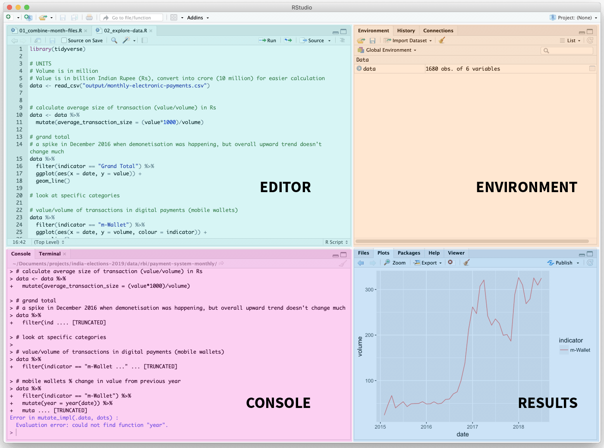
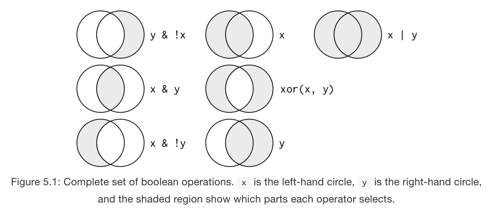

# R basics

R is an open source statistical and visualisation software that is commonly used for data intensive projects. It has the ability to read large amounts of data (up to 2 billion rows, compared to the 1 million limit in Excel), and has a flexible built-in data visualisation framework.

Before you begin, you should already know (see Data basics):
- How to navigate a spreadsheet
- The basic layout of a dataset: vairables in columns, observations/records in rows
- How to sort and filter data
- How to use spreadsheet formulas (e.g. sum, average)

Working through this guide will take approximately 2 hours.

## Why R?

- Graphics capability
- Automating data wrangling and prototyping tasks (speed)
- Reproducibility, checking and collaboration (improves accuracy)
- Open source and free

## Installing R and RStudio

Base R can be downloaded through [CRAN Mirrors](https://cran.r-project.org/mirrors.html). Select a location that is close to you, and download the right version for your operating system.

It is recommended to install RStudio when working with the R programming language. RStudio is an integrated development envrionment (IDE) for R, and provides a more user friendly interface and workspace. You can [download and install RStudio here](https://rstudio.com/products/rstudio/download/). In the following guide, we will work within the RStudio environment.

## RStudio tour

The RStudio interface is made up of four window panes:



1. **Editor** (upper left)
  - R code editor where you write or open scripts
  - Also view data frames

2. **Working environment** (upper right)
  - Shows your workspace, which includes a list of data objects (data frames, variables) currently in the computer's memory
  - Also history tab with a list of prior commands

3. **Console** (lower left)
  - Interactive console where you can type R code one line at a time
  - Any lines of code that are run from the editor window will also appear in the console

4. **Results** (lower right)
  - Shows plots/charts generated, with a history of previous plots and an option to export as pdf or image file
  - Also shows external packages that are available on your computer, files in your working director and help files

## Getting started with R

To get the hang of how R works, try using it as a simple calculator. Type the following directly into the console after `>` and press enter:

- `2 + 2`
- `10*(5-3)/3+1`

R is case-sensitive! Which means upper and lower case matters. Be careful and precise when you're typing R code.

### Variables

R can calculate and store multiple values in variables to be referenced later.

- Variables have arbitrary names. Names should be meaningful (be nice to your future self and other people looking at your code months later)
- Variables are created using the `<-` assignment operator (keyboard shortcut: `alt` + `-`)

Let's create the variable `x` and give it a value of 10, and `y` with value of 2.

- Note that in the working environment panel the object is listed with its current value
- Can perform mathematical operations with variables, e.g. try typing in `x + y`

Think of variables as buckets holding a certain value. You can replace stuff inside the bucket by assigning a new value to `x`.

- `x <- x + 2`: what becomes of `x` now?

You can assign almost anything as a variable: a single value, list of values, data frames, functions etc.

### Functions

Everything in R is done through functions. Functions are like formulas in spreadsheets. They are actions that you can perform on data objects. Function keywords are usually verbs that performs a specific task, e.g. `filter`, `arrange`, `select` etc.

- Functions manipulate objects
- An object is anything that can be assigned to a variable name; includes constants, data structures, other functions, and even graphs
- Functions take one or more arguments inside parentheses - these are inputs that the function needs in order to run, e.g. `read_csv()` requires the path of the data file: `read_csv("example.csv")`. Multiple arguments are separated by a comma `,`
- Most functions, after performing the action, returns some value which can then be assigned to a variable
- For example, the `sqrt()` function returns the square root of some number, e.g. `sqrt(16)`
- You can write your own functions! (But we won't be covering it in this guide)

When running functions, take care in getting the syntax correct, like keeping track of parentheses, commas, spelling, and upper/lower cases. It is very common to run functions within functions in R. There is no way to memorise every function in the R universe, so get comfortable with looking up documentation and googling for answers. (There are also cheatsheets available ‒ see Resources section below.)

### Command line vs scripts

We can type out code line by line into RStudio console, but to make it easier to reuse code, we can put all our code into a script. Make a new script in the top left window: *File > New File > R Script*.

The main advantage of scripts is that we can store a series of complex data cleaning and analysis steps in a single file that can be run later. This lets us re-use all of our code on similar data in one go without having to repeat all the steps.

To run a specific line of code, place the cursor on the line, then hit `cmd` + `enter`. The code will run in the console below. To run an entire script, either highlight the entire script and hit run, or use the source button.

**Comments**: any line of code preceded by `#` means it's a comment and will not be treated as executable code and R will skip running it as a command. It is good practice to use comments to describe what's happening in your code. This makes your scripts easier to understand - for future you and other people in your team.

### Working with directories

To work with files within R, we have to set the working directory (i.e. folder) to where your files are on your computer. We can set the directory using `setwd()`, which takes the file path as an argument.

```
# Example for Mac
setwd("~/Downloads")

# Example for PC
setwd("C:/User/Downloads")
```

You can also set the directory via the menu at the top: *Session > Set Working Directory > Choose directory*. To set your working directory to the folder where your R script is located: *Session > Set Working Directory > To Source File Location*.

Once you've set your working directory, all file paths are now relative to that directory. For example, if you've set your working directory at `~/Desktop/r-basics` (you have a folder called *r-basics* on your desktop), to point to an Excel file in that same folder in your code, the path would just be `example.xlsx`. Or, if the Excel file is within a folder named *data* inside *r-intro*, you would point to it with `data/example.xlsx`.

(Note: always use forward slash `/` when typing out the path, for both Mac and PC.)

Alternatively, you can create a new R project by going to the menu *File > New project...* and choose a new or existing directory. This will set up a project environment for you and create a `.Rproj` file. If you open RStudio by clicking  on the `.Rproj` file, your working directory will automatically be set to that folder, and all your data, scripts and plots will now be relative to the project directory. The idea is that anyone can copy or download that entire project folder and run the code without worrying about setting the working directory manually.

### R packages

Packages (or libraries) are collections of R functions, data, and compiled code that other people have written, put in a well-defined format with proper documentation, and made available for others to download. Packages extend the functionality of base R with specific use cases. People make R libraries for all sorts of different purposes, e.g. *ggplot* is a very popular library for data visualisation.

To install a package in R, type into the console:

```
install.packages("package_name")
```

Packages only need to be installed once on your computer. However, you would need to load the library every time you open RStudio to use it in your code. Usually, loading libraries would be the first lines of code in your script.

```
# Load library for each R session
library(package_name)
```

We are going to be using the `tidyverse` package to work with data in this guide – [tidyverse](https://www.tidyverse.org/) is a suite of packages designed for data manipulation and visualisation developed by Hadley Wickham. It includes popular packages like `dplyr`, `ggplot`, `tidyr` etc.

```
# Run this in the console – only need to do this once on your computer
install.packages("tidyverse")
```

## Let's load some data

Create a `r-basics` folder on your computer, either by creating a new R project, or manually creating a folder and setting the working directory. Then create and save a new script file. Don't forget to load the `tidyverse` package (you should already have it installed). You would also need to download the [data files from here](https://github.com/officeofjane/r-intro/tree/master/r-basics) into the same folder.

The function we use to load data into RStudio is `read_csv()`.

```
# Optional: set working directory to correct folder - your path might be different here
# setwd("~/Desktop/r-basics")

# Load tidyverse package
library(tidyverse)

# Load data into RStudio and assign it to variable district_data
district_data <- read_csv("hk-districts.csv")
```

`read_csv` loads the specified data file into R as a data frame, which is then assigned to the variable `district_data` through the assignment `<-` operator. Click on `district_data` in the environment panel to view the data frame. You'll notice that by default the first row of the data is taken as column headings.

## Sorting rows with `arrange()`

The function for sorting is `arrange()`. It reorders the rows by the specified columns. `arrange(data, ...)` takes the data frame as the first argument, and the variable (column) to sort by in the next argument (multiple columns will be sorted in order).

Let's sort the data so that the constituency with the lowest median income is at the top.

```
district_by_income <- arrange(district_data, median_income)
```

Sort so that the constituency with the biggest population is at the top. `arrange()` sorts the rows by ascending order by default. To sort in descending order, we need to wrap the column argument with another function, `desc()`. 

```
district_by_pop <- arrange(district_data, desc(population))
```

Sort so that districts are clustered in alphabetical order but constituencies are listed in descending order of population. 

```
district_by_cons <- arrange(district_data, district, desc(population))
```

## Filtering rows with `filter()`

`filter()` works by extracting rows that meet a specific criteria. `filter(data, ...)` takes the data frame and applies a logical test (true/false) as a second argument. The function returns rows for which the test is TRUE. For example, we can extract all constituencies under the Wan Chai district with:

```
# Filter Wan Chai district
wanchai <- filter(district_data, district == "Wan Chai")
```

Note the double equal sign `==` instead of a single equal sign when testing for equality. This is because the single `=` behaves like the assignment operator `<-`, which is used to set values to variables, not for comparing things.

Equal is an example of what we call comparison operators. To filter effectively, we need to know how to select the rows we want. R provides a collection of operators: `>`, `>=`, `<`, `<=`, `!=` (not equal), and `==` (equal). 

Let's try another example.

```
# Load readxl library
library(readxl)

# Read NYC dogs data frame and assign it to variable 'nyc_dogs'
nyc_dogs <- read_excel("ny-dogs.xlsx")
```

We can filter for German Shepherd dogs with:

```
german_shepherds <- filter(nyc_dogs, breed == "German Shepherd Crossbreed")

```

What if we want to filter German Shepherds that are predominantly black? To do that, we need *both* `breed == "German Shepherd Crossbreed"` AND `dominant_color == "BLACK"` to test as TRUE.

```
black_german_shepherds <- filter(nyc_dogs, breed == "German Shepherd Crossbreed" & dominant_color == "BLACK")
```

The two arguments to the `filter()` function are combined with `&`. The OR operator `|` works similarly. You can combine different operators to target subsets of the data.



(From [R for Data Science](https://r4ds.had.co.nz/transform.html#logical-operators), by Garrett Grolemund and Hadley Wickham)

## Extracting variables (columns) with `select()`

Sometimes you might have a very large dataset with many variables, and you want to pick specific ones to create a smaller subset. `select()` takes column names as arguments and extracts them from the data frame.

For example, the New York dogs data has 11 variables. If we only care about their names, gender and age, we would select the columns like so:

```
dogs_subset <- select(nyc_dogs, dog_name, gender, birth)
```

## Creating/calculating new variables with `mutate()`

Besides selecting sets of existing columns, we can also create new columns that are calculated based on existing columns. 

```
# Load Japan population data
japan <- read_excel("japan-pop.xlsx")
```

In the Japan data, we have the population and area for every prefecture. Say we want to compare the prefectures by calculating population density, i.e. the number of people per square kilometre for each prefecture. We want to call the new variable `pop_per_sqkm`.

`mutate(data, ...)` adds new columns at the end of your dataset. It takes your data frame as an argument, and applies a formula to the new variable.

```
japan_popdensity <- mutate(japan, pop_per_sqkm = population_2015 / area_sqkm)
```

## Piping: joining commands into a chain with `%>%`

Sometimes we might want to chain steps together. For example, we want to calculate population density **and then** sort them by descending order. 

```
# Calculate population density
japan_popdensity_1 <- mutate(japan, pop_per_sqkm = population_2015 / area_sqkm)

# Sort in population density in descending order
japan_popdensity_2 <- arrange(japan_popdensity_1, desc(pop_per_sqkm)
```

This is not very efficient code because we are creating a new variable for every intermediate step that we don't really need. Imagine we want to do even more to the same data; we would have `japan_popdensity_3`, `japan_popdensity_4` etc. 

We can try overwriting the original variable instead by reassigning the second step to the same variable:

```
# Calculate population density
japan_popdensity <- mutate(japan, pop_per_sqkm = population_2015 / area_sqkm)

# Sort population density in descending order
japan_popdensity <- arrange(japan_popdensity, desc(pop_per_sqkm)
```

It becomes difficult to read though, with a lot of repetition of `japan_popdensity` everywhere, and it's painful to debug if you make a typing mistake somewhere in the chain.

Instead, we can combine the two commands above together using the pipe `%>%` operator.

`%>%` is used to connect a sequence of multiple operations. It serves as the equivalent of saying "and then...". It takes out the intermediate data frame as the first argument, leaving:

```
japan_popdensity <- japan %>%
  mutate(pop_per_sqkm = population_2015 / area_sqkm) %>%
  arrange(desc(pop_per_sqkm))
```

This is much more readable code. It's saying: "take the `japan` data, *and then* create a new variable called `pop_per_sqkm`, *and then* sort it by descending order by density, and assign the result of that to the variable `japan_popdensity`.

## Generate group summaries with `group_by()`

Let's look further into our Japan data. There are different number of prefectures in each region. For example, 9 prefectures in Chubu, 5 in Chugoku, and 1 in Hokkaido. Is there a way to find out how many prefectures there are in each region without manually counting?

We can group the data by region, and then count them separately using `group_by()`.

```
regions <- japan %>%
  group_by(region)
```

You'll notice that nothing happens after running the above line of code. That is because all we've told R to do is to change the scope of how the data is operated upon (i.e. from the entire dataset to group‒by‒group), but we haven't told it what to do to each group yet. In this case, we want to `count` the number of observations (rows) in each group (i.e. region).

```
regions <- japan %>%
  group_by(region) %>%
  count()
```

The result gives us a summary table of the number of prefectures for each region. We can chain more steps and sort by descending order by piping `arrange()`.

```
regions <- japan %>%
  group_by(region) %>%
  count() %>%
  arrange(desc(n))
```

You can reuse this code easily if you want to carry out similar steps on a completely different dataset. For example, if you want to count the number of dogs for each breed in the New York dogs dataset:

```
breeds <- nyc_dogs %>%
  group_by(breed) %>%
  count() %>%
  arrange(desc(n))
```

This is the power of writing code!

(Note: for those familiar, using `group_by()` followed by other functions is the same as pivot tables in spreadsheets.)

## Common R mistakes

- Using the wrong case ‒ all functions are case sensitive, e.g. `hello <- 5` vs `Hello`
- Forgetting to use quote marks when they are needed, and vice versa
- Using a function from a package that is not loaded
    - Try `read_csv` without loading `tidyverse`

## R help

R offers good resources to help us learn about its functions. Put a question mark `?` before a function name, and documentation containing details about that function would show up in the results panel, e.g. `?read_excel`.

And, as always, google for answers whenever you're stuck.

## Resources

- [R for Data Science](https://r4ds.had.co.nz/)
- [R for Journalists](https://learn.r-journalism.com/en/)
- [Storytelling with R at Propublica](https://resources.rstudio.com/rstudio-conf-2018/storytelling-with-r-olga-pierce), Olga Pierce
- [RStudio Data Transformation Cheatsheet](https://github.com/rstudio/cheatsheets/blob/main/data-transformation.pdf)
